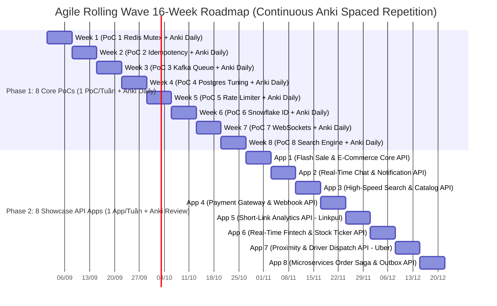

# 🗺️ SENIOR FULLSTACK & SYSTEM DESIGN 16-WEEK AGILE ROADMAP (2-PHASE ARCHITECTURE)

> **Goal:** Master Senior Backend & System Design, build 8 PoC Building Blocks + 8 Live System Showcase Apps on Contabo VPS, and achieve Senior/Lead Engineer level for top-tier job offers.  
> **Methodology:** **Agile Rolling Wave (Cuốn chiếu 100%)** — Anki trải đều liên tục 16 tuần (Spaced Repetition) + Mỗi PoC / Showcase App được build ➔ Deploy VPS (API-only) ➔ k6 Load Test ➔ Update CV ngay trong tuần đó!  
> **Pacing:** Anki ôn lặp ngắt quãng liên tục 16 tuần (~25-30 câu mới/ngày) + 1 PoC hoặc 1 Showcase App/tuần (1.5 - 2h/ngày trong giờ làm việc).

---

## 📊 1. MERMAID ROLLING TIMELINE (2 PHASES - 16 WEEKS)

---

## 📅 2. BẢNG PHÂN BỔ ANKI (TRẢI ĐỀU 16 TUẦN) & POC / SHOWCASE APPS

| Tuần | Bộ Anki Tiêu điểm (Ôn ngắt quãng 25-30 câu/ngày) | PoC Module (Phase 1) / Showcase App (Phase 2) | Deliverables & CV Milestone |
|---|---|---|---|
| **Tuần 1** | `01_DesignPatterns_OOP` (SOLID, GoF, OOP 4 Pillars) | **PoC 1:** Redis Mutex & Atomic Lua Script (`DECR`) | Demo Anti-Over-selling Engine + k6 5k QPS chart |
| **Tuần 2** | `02_Redis_Caching` (Redis Data Types, Eviction, Sentinel) | **PoC 2:** Idempotency Key Middleware (`X-Idempotency-Key`) | Demo Payment Webhook Anti-Duplicate System |
| **Tuần 3** | `03_Kafka_EventDriven` (Event-Driven, Consumer Groups) | **PoC 3:** BullMQ/Kafka Worker + Manual ACK + DLQ | Demo Resilient Async Queue & DLQ Retry Engine |
| **Tuần 4** | `04_SQL_PostgreSQL_Mastery` Part 1 (Queries & Joins) | **PoC 4:** Postgres 1M Rows + EXPLAIN ANALYZE + Indexes | Demo DB Query Tuning & Indexing Benchmark Lab |
| **Tuần 5** | `04_SQL_PostgreSQL_Mastery` Part 2 (Indexes & Locks) | **PoC 5:** Token Bucket / Sliding Window Rate Limiter | Demo API Gateway Traffic Throttling Module |
| **Tuần 6** | `04_SQL_PostgreSQL_Mastery` Part 3 (MVCC & Vacuum) | **PoC 6:** Snowflake Distributed Unique ID Generator | Demo Distributed 64-bit ID Service |
| **Tuần 7** | `05_Storage_DDIA` Part 1 (B+Tree vs LSM-Tree) | **PoC 7:** Socket.io + Redis PubSub + Room State | Demo Real-time WebSocket Messaging Hub |
| **Tuần 8** | `05_Storage_DDIA` Part 2 (Replication & Consensus) | **PoC 8:** Meilisearch + Redis Bloom + GIN Index | Demo High-Speed Search & Anti-DB Spam Engine |
| **Tuần 9** | `06_SystemDesign_Architecture` Part 1 (Alex Scenarios) | **App 1:** Flash Sale & E-Commerce Core API | Live API App 1 + k6 5k QPS load chart |
| **Tuần 10** | `06_SystemDesign_Architecture` Part 2 (Microservices) | **App 2:** Real-Time Chat & Notification API | Live API App 2 + WebSockets Server |
| **Tuần 11** | `06_SystemDesign_Architecture` Part 3 (Resilience) | **App 3:** High-Speed Search & Catalog API | Live API App 3 + Meilisearch Engine |
| **Tuần 12** | `07_Networking_Security` Part 1 (TLS, HTTP/2, OAuth2) | **App 4:** Payment Gateway & Webhook API | Live API App 4 + Anti-Duplicate Webhook |
| **Tuần 13** | `07_Networking_Security` Part 2 (Security & Epoll) | **App 5:** Short-Link Analytics API (Linkpul) | Live API App 5 + HyperLogLog UV Analytics |
| **Tuần 14** | Review All Anki Decks (Flashcards Spaced Repetition) | **App 6:** Real-Time Fintech Ticker API (Index) | Live API App 6 + TimescaleDB CAGGs |
| **Tuần 15** | Review All Anki Decks & Mock Interview Practice | **App 7:** Proximity & Driver Dispatch API (Uber) | Live API App 7 + Redis GeoHashes |
| **Tuần 16** | Review All Anki Decks & Salary Negotiation Deal | **App 8:** Microservices Order Saga & Outbox API | Live API App 8 + Full Senior/Lead Portfolio |

---

## ⏰ 3. DAILY WORKLOAD HÀNG NGÀY TRONG GIỜ LÀM VIỆC (1.5 - 2 TIẾNG/NGÀY)

- ☕ **Khối 1 (45 phút):** Mở Anki cày **~25-30 câu/ngày** (Spaced Repetition liên tục 16 tuần). Đọc ngẫm để hiểu thấu bản chất, nhẩm kịch bản 4 Level.
- 💻 **Khối 2 (45 phút):** Nhờ AI gen code PoC (Phase 1) hoặc Showcase API App (Phase 2) của tuần đó, chạy local (`docker-compose up`), soi từng dòng code hiểu cơ chế.
- 🚀 **Khối 3 (30 phút):** Commit code lên Git & Deploy lên VPS Contabo ➔ Chạy k6 test 5k QPS ➔ Cập nhật CV!
