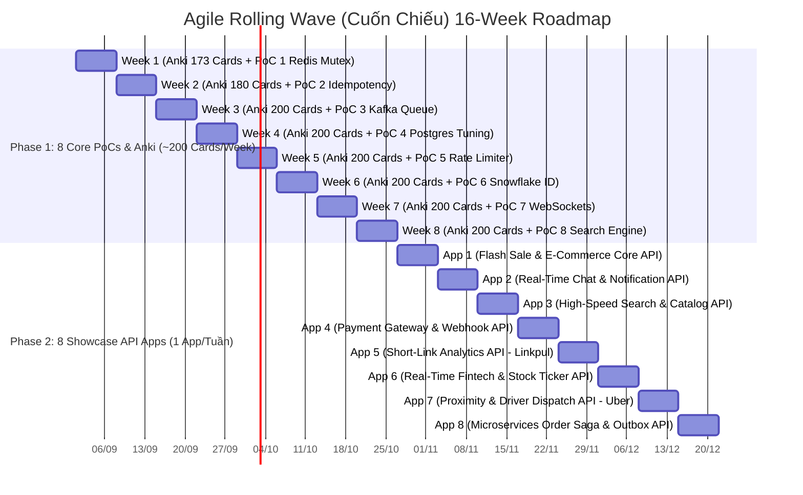

# 🗺️ SENIOR FULLSTACK & SYSTEM DESIGN 16-WEEK AGILE ROADMAP (2-PHASE ARCHITECTURE)

> **Goal:** Master Senior Backend & System Design, build 8 PoC Building Blocks + 8 Live Showcase API Apps on Contabo VPS, and achieve Senior/Lead Engineer level for top-tier job offers.  
> **Methodology:** **Agile Rolling Wave (Cuốn chiếu 100%)** — Mỗi PoC / Showcase App được build ➔ Deploy VPS (API-only) ➔ k6 Load Test ➔ Update CV ngay trong tuần đó!  
> **Pacing:** ~200 câu Anki/tuần (~30 câu/ngày) + 1 PoC hoặc 1 App/tuần (1.5 - 2h/ngày trong giờ làm việc).

---

## 📊 1. MERMAID ROLLING TIMELINE (2 PHASES - 16 WEEKS)

---

## 📅 2. BẢNG CHI TIẾT PHASE 1: 8 CORE POC MODULES (TUẦN 1 ➔ TUẦN 8)

| Tuần | Bộ Anki Mục tiêu (~200 câu/tuần) | PoC / Module Kỹ thuật Cuốn chiếu | Sản phẩm VPS Contabo & Deliverables |
|---|---|---|---|
| **Tuần 1** | **173 câu** (`01_DesignPatterns` 61 câu + `02_Redis` 112 câu) | **PoC 1:** Redis Mutex & Atomic Lua Script (`DECR`) | Demo Anti-Over-selling Engine + k6 5k QPS chart |
| **Tuần 2** | **180 câu** (`03_Kafka_EventDriven` 140 câu + `04_SQL` 40 câu) | **PoC 2:** Idempotency Key Middleware (`X-Idempotency-Key`) | Demo Payment Webhook Anti-Duplicate System |
| **Tuần 3** | **200 câu** (`04_SQL_PostgreSQL_Mastery` 200 câu tiếp) | **PoC 3:** BullMQ/Kafka Worker + Manual ACK + DLQ | Demo Resilient Async Queue & DLQ Retry Engine |
| **Tuần 4** | **200 câu** (`04_SQL_PostgreSQL_Mastery` 200 câu tiếp) | **PoC 4:** Postgres 1M Rows + EXPLAIN ANALYZE + Indexes | Demo DB Query Tuning & Indexing Benchmark Lab |
| **Tuần 5** | **200 câu** (`05_Storage_DDIA` 200 câu) | **PoC 5:** Token Bucket / Sliding Window Rate Limiter | Demo API Gateway Traffic Throttling Module |
| **Tuần 6** | **200 câu** (`05_Storage_DDIA` 200 câu tiếp) | **PoC 6:** Snowflake Distributed Unique ID Generator | Demo Distributed 64-bit ID Service |
| **Tuần 7** | **200 câu** (`06_SystemDesign` 200 câu) | **PoC 7:** Socket.io + Redis PubSub + Room State | Demo Real-time WebSocket Messaging Hub |
| **Tuần 8** | **200 câu** (`06_SystemDesign` 200 câu tiếp) | **PoC 8:** Meilisearch + Redis Bloom + GIN Index | Demo High-Speed Search & Anti-DB Spam Engine |

---

## 🏗️ 3. BẢNG CHI TIẾT PHASE 2: 8 SHOWCASE API APPS (TUẦN 9 ➔ TUẦN 16 - ONLY API)

| Tuần | Showcase API App Name | PoCs Được Tích Hợp Lại | Kiến trúc API & Endpoint Core | Output VPS & CV Showcase |
|---|---|---|---|---|
| **Tuần 9** | **App 1: Flash Sale & E-Commerce Core API** | PoC 1 + PoC 2 + PoC 3 + PoC 5 | `POST /api/v1/flash-sale/orders` (Redis Mutex + Rate Limiter + Queue) | Live API Endpoint + k6 5k QPS load chart |
| **Tuần 10** | **App 2: Real-Time Chat & Notification API** | PoC 7 + PoC 4 + PoC 6 | `WS /ws/chat` & `POST /api/v1/notifications` (WebSockets + Snowflake ID + DLQ) | Live WS Server + Multi-room Chat API |
| **Tuần 11** | **App 3: High-Speed Search & Catalog API** | PoC 8 + PoC 4 | `GET /api/v1/products/search?q=` (Meilisearch + BloomFilter + GIN Index) | Fast Search API (<3ms response time) |
| **Tuần 12** | **App 4: Payment Gateway & Webhook Aggregator API** | PoC 2 + PoC 3 | `POST /api/v1/webhooks/vnpay` (Idempotency Key + Retry Backoff) | Anti-Duplicate Payment Callback API |
| **Tuần 13** | **App 5: Short-Link Analytics API (Linkpul-style)** | PoC 5 + PoC 6 + HyperLogLog | `POST /api/v1/shorten` & `GET /:code` (Rate Limiter + Snowflake + HyperLogLog UV) | High-Throughput Short-Link API |
| **Tuần 14** | **App 6: Real-Time Fintech & Stock Ticker API (Index-style)** | PoC 7 + Postgres TimescaleDB | `GET /api/v1/stocks/candles` & `SSE /sse/ticks` (TimescaleDB CAGGs + Redis L2) | Live Fintech Candle & Ticker API |
| **Tuần 15** | **App 7: Proximity & Driver Dispatch API (Uber-style)** | PoC 6 + PoC 7 + Redis Geo | `POST /api/v1/drivers/nearby` & `WS /ws/ride` (Redis GeoHashes + WebSockets) | Driver Matching & Geo-Spatial Search API |
| **Tuần 16** | **App 8: Microservices Order Saga & Outbox System API** | PoC 3 + Saga Orchestrator | `POST /api/v1/orders/checkout` (Transactional Outbox + Saga State Machine) | Event-Driven Saga Microservices API |

---

## ⏰ 4. DAILY WORKLOAD HÀNG NGÀY TRONG GIỜ LÀM VIỆC (1.5 - 2 TIẾNG/NGÀY)

- ☕ **Khối 1 (45 phút):** Mở Anki cày **~30 câu/ngày** (Đạt mốc ~200 câu/tuần). Đọc ngẫm để hiểu thấu bản chất, nhẩm kịch bản 4 Level.
- 💻 **Khối 2 (45 phút):** Nhờ AI gen code PoC hoặc Showcase API App của tuần đó, chạy local (`docker-compose up`), soi từng dòng code hiểu cơ chế.
- 🚀 **Khối 3 (30 phút):** Commit code lên Git & Deploy lên VPS Contabo ➔ Chạy k6 test 5k QPS ➔ Cập nhật CV!
