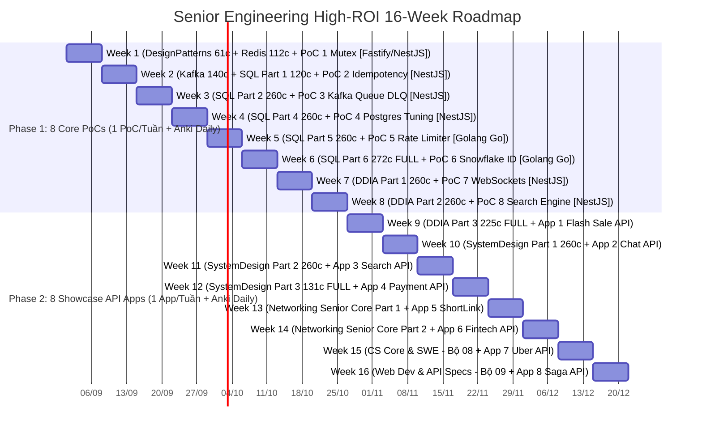

# 🗺️ SENIOR FULLSTACK & SYSTEM DESIGN 16-WEEK AGILE ROADMAP (HIGH-ROI BALANCED)

> **Goal:** Master high-ROI cards across SQL, DDIA, System Design, Senior Networking & CS Core, build 8 PoC Building Blocks + 8 Live System Showcase Apps on Contabo VPS, and achieve Senior/Lead Engineer level for top-tier job offers.  
> **Tech Stack Strategy:** **NestJS / Fastify (TypeScript)** làm khung chủ lực cho 80% PoCs & Showcase Apps + **Golang (Go)** làm điểm nhấn đổi gió cho **PoC 5 (Rate Limiter)** & **PoC 6 (Snowflake ID Generator)** để chứng minh tư duy Multi-Language Senior Engineer trên Portfolio GitHub!  
> **Anki Algorithm Rules:** Bắt buộc hoàn thành **Due Reviews (Bài cũ lặp lại)** hàng ngày trước khi mở **New Cards**. Không có "tuần nghỉ review", Anki chạy lặp ngắt quãng liên tục 16 tuần!

---

## 📊 1. MERMAID ROLLING TIMELINE (2 PHASES - 16 WEEKS HIGH-ROI)

---

## 📅 2. BẢNG PHÂN BỔ BỘ ANKI HIGH-ROI (TỐI ƯU BỘ 07, 08 & 09)

| Tuần | Thẻ Anki Học Mới & Ôn Lặp Hàng Ngày | PoC (Phase 1) / Showcase API App (Phase 2) | Tech Stack & Output VPS Contabo |
|---|---|---|---|
| **Tuần 1** | **`01_DesignPatterns` (61 câu)** + **`02_Redis` (112 câu)** | **PoC 1:** Redis Mutex & Atomic Lua Script (`DECR`) | **NestJS / Fastify (TS)** + k6 5k QPS chart |
| **Tuần 2** | **`03_Kafka` (140 câu)** + **`04_SQL` (120 câu đầu)** | **PoC 2:** Idempotency Key Engine & **Bitwise RBAC + CASL ABAC Guard** | **NestJS (TS)** + Webhook Deduplication & O(1) Bitmask Auth |
| **Tuần 3** | **`04_SQL_PostgreSQL_Mastery` (260 câu tiếp)** | **PoC 3:** BullMQ/Kafka Worker + Manual ACK + DLQ | **NestJS (TS)** + Resilient Async Queue & DLQ |
| **Tuần 4** | **`04_SQL_PostgreSQL_Mastery` (260 câu tiếp)** | **PoC 4:** Postgres 1M Rows + EXPLAIN ANALYZE + Indexes | **NestJS (TS)** + DB Query Tuning Benchmark |
| **Tuần 5** | **`04_SQL_PostgreSQL_Mastery` (260 câu tiếp)** | **PoC 5:** Token Bucket / Sliding Window Rate Limiter | **Golang (Go)** + Traffic Throttling Module |
| **Tuần 6** | **`04_SQL_PostgreSQL_Mastery` (272 câu cuối - TRỌN BỘ 1,172 CÂU)** | **PoC 6:** Snowflake Distributed Unique ID Generator | **Golang (Go)** + Distributed 64-bit ID Service |
| **Tuần 7** | **`05_Storage_DDIA` (260 câu đầu)** | **PoC 7:** Socket.io + Redis PubSub + Room State | **NestJS (TS)** + Real-time WebSocket Messaging Hub |
| **Tuần 8** | **`05_Storage_DDIA` (260 câu tiếp)** | **PoC 8:** Meilisearch + Redis Bloom + GIN Index | **NestJS (TS)** + High-Speed Search Engine |
| **Tuần 9** | **`05_Storage_DDIA` (225 câu cuối - TRỌN BỘ 745 CÂU)** | **App 1:** Flash Sale & E-Commerce Core API | Live API App 1 + k6 5k QPS load chart |
| **Tuần 10** | **`06_SystemDesign_Architecture` (260 câu đầu)** | **App 2:** Real-Time Chat & Notification API | Live API App 2 + WebSockets Server |
| **Tuần 11** | **`06_SystemDesign_Architecture` (260 câu tiếp)** | **App 3:** High-Speed Search & Catalog API | Live API App 3 + Meilisearch Engine |
| **Tuần 12** | **`06_SystemDesign_Architecture` (131 câu cuối - TRỌN BỘ 651 CÂU)** | **App 4:** Payment Gateway & Webhook API | Live API App 4 + Anti-Duplicate Webhook |
| **Tuần 13** | **`07_Networking_Security` (Thẻ Senior/Mid:** TLS 1.3, HTTP/2, HTTP/3, OAuth2) | **App 5:** Short-Link Analytics API (Linkpul) | Live API App 5 + HyperLogLog UV Analytics |
| **Tuần 14** | **`07_Networking_Security` (Thẻ Senior/Mid:** epoll, Socket Buffers, CORS Security) | **App 6:** Real-Time Fintech Ticker API (Index) | Live API App 6 + TimescaleDB CAGGs |
| **Tuần 15** | **`08_ComputerScience_SWE_optional` (Thẻ High-ROI:** Concurrency, Memory Models) | **App 7:** Proximity & Driver Dispatch API (Uber) | Live API App 7 + Redis GeoHashes |
| **Tuần 16** | **`09_WebDev_GeneralCS_optional` (Thẻ High-ROI:** API Specs, Web Architecture) | **App 8:** Microservices Order Saga & Outbox API | Live API App 8 + Full Senior/Lead Portfolio |

---

## ⏰ 3. QUY TRÌNH HỌC ANKI BẮT BUỘC HÀNG NGÀY (DAILY ALGORITHM RULE)

- ☕ **BƯỚC 1 (BẮT BUỘC): Hoàn thành bài cũ Due Reviews trước!**  
  Mở Anki xử lý cạn toàn bộ thẻ Due Reviews (bài cũ đến hạn lặp lại). Không bao giờ được bỏ qua Due Reviews để học thẻ mới!
- ☕ **BƯỚC 2: Mở thẻ New Cards học mới.**  
  Sau khi hoàn thành Due Reviews, Anki sẽ nhả thẻ mới của tuần đó. Đọc ngẫm để hiểu thấu bản chất, nhẩm kịch bản 4 Level.
- 💻 **BƯỚC 3: AI Code PoC / Showcase App (45 phút).**  
  Nhờ AI gen code PoC (Phase 1) hoặc Showcase API App (Phase 2), chạy local (`docker-compose up`), soi từng dòng code.
- 🚀 **BƯỚC 4: Deploy Contabo VPS & Load Test k6 (30 phút).**  
  Commit code lên Git ➔ Deploy lên VPS Contabo ➔ Chạy k6 test 5k QPS ➔ Cập nhật CV!
