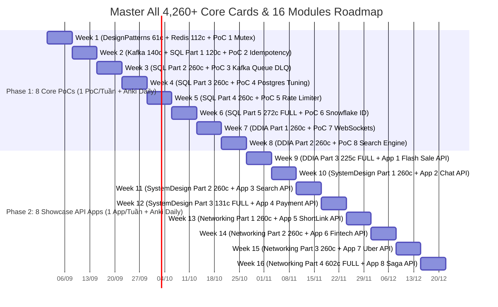

# 🗺️ SENIOR FULLSTACK & SYSTEM DESIGN 16-WEEK AGILE ROADMAP (MASTER ALL CARDS)

> **Goal:** Master 100% ALL cards across SQL, DDIA, System Design & Networking, build 8 PoC Building Blocks + 8 Live System Showcase Apps on Contabo VPS, and achieve Senior/Lead Engineer level for top-tier job offers.  
> **Anki Algorithm Rules:** Bắt buộc hoàn thành **Due Reviews (Bài cũ lặp lại)** hàng ngày trước khi mở **New Cards (~35-40 câu mới/ngày)**. Không có "tuần nghỉ review", Anki chạy lặp ngắt quãng liên tục 16 tuần!  
> **Pacing:** ~260 câu mới/tuần (~35-40 câu mới/ngày) + 1 PoC hoặc 1 Showcase App/tuần (1.5 - 2h/ngày trong giờ làm việc).

---

## 📊 1. MERMAID ROLLING TIMELINE (2 PHASES - 16 WEEKS FULL MASTER)

---

## 📅 2. BẢNG PHÂN BỔ 100% TẤT CẢ CÁC THẺ ANKI (MASTER ALL 4,263 THẺ CORE)

| Tuần | Tiến độ Anki New Cards (~260 câu mới/tuần) | Thẻ Anki Học Mới & Ôn Lặp Hàng Ngày | PoC (Phase 1) / Showcase API App (Phase 2) | Deliverables & Output VPS Contabo |
|---|---|---|---|---|
| **Tuần 1** | **173 câu** (FULL `01` & `02`) | **`01_DesignPatterns` (61 câu)** + **`02_Redis` (112 câu)** | **PoC 1:** Redis Mutex & Atomic Lua Script (`DECR`) | Demo Anti-Over-selling Engine + k6 5k QPS chart |
| **Tuần 2** | **260 câu** (FULL `03` + SQL Part 1) | **`03_Kafka` (140 câu)** + **`04_SQL` (120 câu đầu)** | **PoC 2:** Idempotency Key Middleware (`X-Idempotency-Key`) | Demo Payment Webhook Anti-Duplicate System |
| **Tuần 3** | **260 câu** (SQL Part 2) | **`04_SQL_PostgreSQL_Mastery` (260 câu tiếp)** | **PoC 3:** BullMQ/Kafka Worker + Manual ACK + DLQ | Demo Resilient Async Queue & DLQ Retry Engine |
| **Tuần 4** | **260 câu** (SQL Part 3) | **`04_SQL_PostgreSQL_Mastery` (260 câu tiếp)** | **PoC 4:** Postgres 1M Rows + EXPLAIN ANALYZE + Indexes | Demo DB Query Tuning & Indexing Benchmark Lab |
| **Tuần 5** | **260 câu** (SQL Part 4) | **`04_SQL_PostgreSQL_Mastery` (260 câu tiếp)** | **PoC 5:** Token Bucket / Sliding Window Rate Limiter | Demo API Gateway Traffic Throttling Module |
| **Tuần 6** | **272 câu** (FULL 1,172 câu `04_SQL`!) | **`04_SQL_PostgreSQL_Mastery` (272 câu cuối - TRỌN BỘ 1,172 CÂU)** | **PoC 6:** Snowflake Distributed Unique ID Generator | Demo Distributed 64-bit ID Service |
| **Tuần 7** | **260 câu** (DDIA Part 1) | **`05_Storage_DDIA` (260 câu đầu)** | **PoC 7:** Socket.io + Redis PubSub + Room State | Demo Real-time WebSocket Messaging Hub |
| **Tuần 8** | **260 câu** (DDIA Part 2) | **`05_Storage_DDIA` (260 câu tiếp)** | **PoC 8:** Meilisearch + Redis Bloom + GIN Index | Demo High-Speed Search & Anti-DB Spam Engine |
| **Tuần 9** | **225 câu** (FULL 745 câu `05_DDIA`!) | **`05_Storage_DDIA` (225 câu cuối - TRỌN BỘ 745 CÂU)** | **App 1:** Flash Sale & E-Commerce Core API | Live API App 1 + k6 5k QPS load chart |
| **Tuần 10** | **260 câu** (SystemDesign Part 1) | **`06_SystemDesign_Architecture` (260 câu đầu)** | **App 2:** Real-Time Chat & Notification API | Live API App 2 + WebSockets Server |
| **Tuần 11** | **260 câu** (SystemDesign Part 2) | **`06_SystemDesign_Architecture` (260 câu tiếp)** | **App 3:** High-Speed Search & Catalog API | Live API App 3 + Meilisearch Engine |
| **Tuần 12** | **131 câu** (FULL 651 câu `06_SystemDesign`!) | **`06_SystemDesign_Architecture` (131 câu cuối - TRỌN BỘ 651 CÂU)** | **App 4:** Payment Gateway & Webhook API | Live API App 4 + Anti-Duplicate Webhook |
| **Tuần 13** | **260 câu** (Networking Part 1) | **`07_Networking_Security` (260 câu đầu)** | **App 5:** Short-Link Analytics API (Linkpul) | Live API App 5 + HyperLogLog UV Analytics |
| **Tuần 14** | **260 câu** (Networking Part 2) | **`07_Networking_Security` (260 câu tiếp)** | **App 6:** Real-Time Fintech Ticker API (Index) | Live API App 6 + TimescaleDB CAGGs |
| **Tuần 15** | **260 câu** (Networking Part 3) | **`07_Networking_Security` (260 câu tiếp)** | **App 7:** Proximity & Driver Dispatch API (Uber) | Live API App 7 + Redis GeoHashes |
| **Tuần 16** | **602 câu** (FULL 1,382 câu `07_Networking`!) | **`07_Networking_Security` (602 câu cuối - TRỌN BỘ 1,382 CÂU)** | **App 8:** Microservices Order Saga & Outbox API | Live API App 8 + Full Senior/Lead Portfolio |

---

## ⏰ 3. QUY TRÌNH HỌC ANKI BẮT BUỘC HÀNG NGÀY (DAILY ALGORITHM RULE)

- ☕ **BƯỚC 1 (BẮT BUỘC): Hoàn thành bài cũ Due Reviews trước!**  
  Mở Anki xử lý cạn toàn bộ thẻ Due Reviews (bài cũ đến hạn lặp lại). Không bao giờ được bỏ qua Due Reviews để học thẻ mới!
- ☕ **BƯỚC 2: Mở ~35-40 thẻ New Cards học mới.**  
  Sau khi hoàn thành Due Reviews, Anki sẽ nhả ~35-40 thẻ mới của tuần đó. Đọc ngẫm để hiểu thấu bản chất, nhẩm kịch bản 4 Level.
- 💻 **BƯỚC 3: AI Code PoC / Showcase App (45 phút).**  
  Nhờ AI gen code PoC (Phase 1) hoặc Showcase API App (Phase 2), chạy local (`docker-compose up`), soi từng dòng code.
- 🚀 **BƯỚC 4: Deploy Contabo VPS & Load Test k6 (30 phút).**  
  Commit code lên Git ➔ Deploy lên VPS Contabo ➔ Chạy k6 test 5k QPS ➔ Cập nhật CV!
