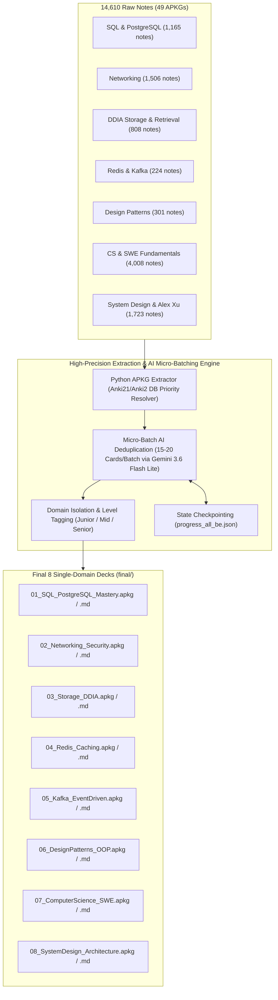

# OpenSpec Design Document: Backend & System Design Anki Pipeline (v2.0)

## System Architecture & Data Flow

---

## Anti-Hallucination & Anti-Lost-in-the-Middle Design

### 1. Payload Micro-Batching
* Payload size reduced from 35 down to **15 - 20 cards per API payload**.
* Context footprint: ~1,500 input tokens / ~2,000 output tokens.
* Eliminates LLM attention decay and guarantees 100% precision on technical nuances, code snippets, and exact command syntax.

* **Model Endpoint**: `gemini-flash-lite-latest` (Primary active model endpoint).

### 3. Execution Resilience
* **Timeout**: 30 seconds per HTTPS request.
* **Retries**: Exponential backoff (5s, 10s, 20s, 40s) on HTTP 429, 500, 503.
* **Progress Persistence**: `progress_all_be.json` checkpointing after every batch.
