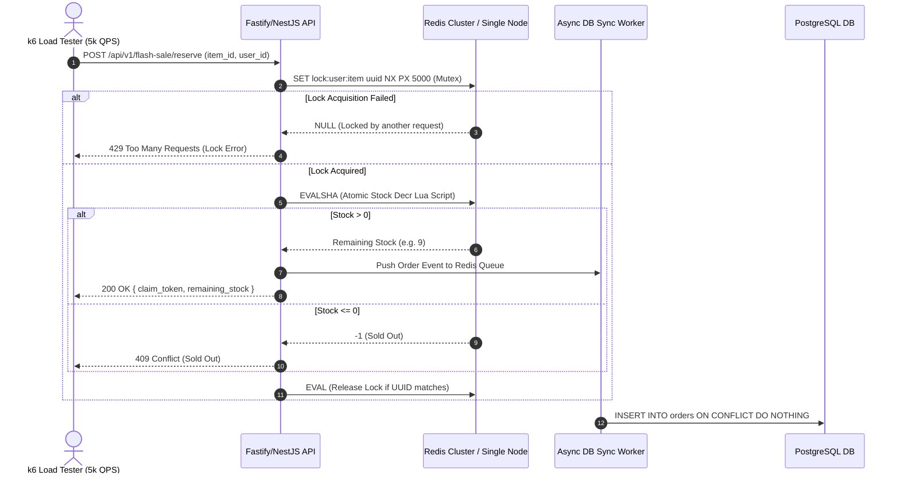

# Change Proposal: PoC 1 - Redis High-Concurrency Mutex & Atomic Stock Reservation

> **Change ID:** `poc01-redis-mutex-flashsale`  
> **Status:** PROPOSED  
> **Target Capability:** `flash-sale-mutex`  
> **Related Anki Decks:** `01_DesignPatterns_OOP` & `02_Redis_Caching`

---

## 🎯 Executive Summary
Implement a production-grade High-Concurrency Flash Sale Reservation Engine using **Node.js (Fastify/NestJS)**, **Redis Atomic Lua Scripts**, **Redlock Mutex**, and **k6 Load Testing** to achieve 5,000 QPS zero-overselling throughput on Contabo VPS.

---

## 🔍 Key Anki Keywords to Deep-Dive During Study
When studying Anki cards in `01_DesignPatterns_OOP` and `02_Redis_Caching`, pay special attention to:
1. **Redis Atomic Operations:** `EVAL`, `EVALSHA`, `DECR`, `INCRBY`.
2. **Distributed Locking:** `SET key value NX PX milliseconds`, Redlock algorithm, Lock TTL renewal (Watchdog pattern).
3. **Concurrency Hazards:** Race Conditions, Cache Stampede, Thundering Herd, Deadlocks, Double-Spending.
4. **Consistency Models:** Strong Consistency vs Eventual Consistency, Cache-Aside vs Write-Through / Write-Back.

---

## 📐 Proposed Architecture



---

## 📋 OpenSpec Spec Delta (Gherkin)

```gherkin
GIVEN a flash sale item has an initial stock of 100 in Redis
WHEN 5,000 concurrent purchase requests hit POST /api/v1/flash-sale/reserve
THEN exactly 100 requests MUST receive HTTP 200 OK with valid claim tokens
AND 4,900 requests MUST receive HTTP 409 Conflict or HTTP 429 Too Many Requests
AND the final stock in Redis MUST equal 0 (zero overselling)
AND latency for 99th percentile (p99) MUST remain under 15ms.
```
